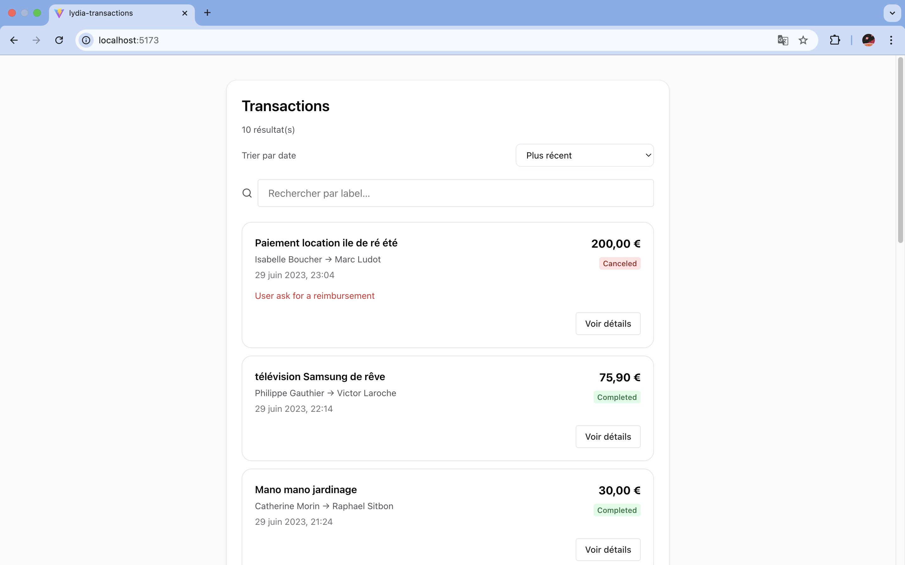
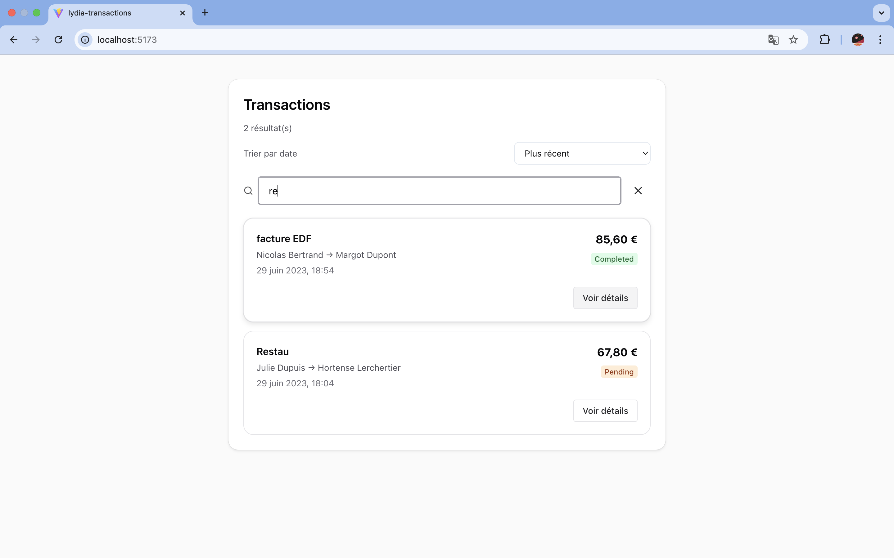
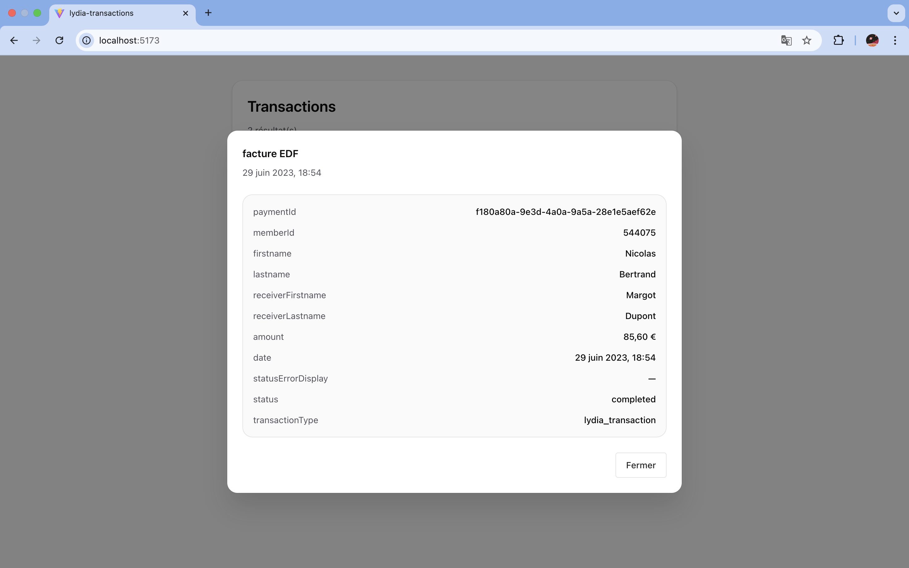

# Lydia Transactions – Frontend Challenge

React application used to display, search, filter and sort a list of transactions.

This project was built using good engineering practices (TypeScript, separation of concerns, testing, feature-based architecture).

---

# Overview

Features :

- Features
- Search by label (case-insensitive)
- Sort by date (asc / desc)
- Transaction details modal
- Loading / error / empty states

---

# Technologies Used

Frontend :

- React 19.2.4
- TypeScript 5.9.3
- Vite 7.3.1

UI :

- Chakra UI v3

Data fetching :

- TanStack Query v5

Testing :

- Vitest 4.0.18
- Testing Library
- Playwright (E2E)

---

# Prerequisites

- Node.js >= 20.19
- npm >= 10

Check versions :

- node -v
- npm -v

--- 

# Project Installation

## 1. Clone the repository : 

git clone https://github.com/Aliouachaima/lydia-frontend-test.git 

## 2. Go into the project folder : 

cd lydia-frontend-test

## 3. Install dependencies :

npm install

# Environment Variables

## Create a file : 
.env

## Add : 

VITE_TRANSACTIONS_URL="JSON_URL"

The JSON URL is : "https://file.notion.so/f/f/7c9d0d81-e08e-4a47-ad18-8806dd0d43a6/2b491f87-68e5-48ab-b893-6769f25556d2/transactions.json?table=block&id=22e9a59d-afa5-4b0c-ad9d-770601425149&spaceId=7c9d0d81-e08e-4a47-ad18-8806dd0d43a6&expirationTimestamp=1770597615395&signature=Zh0blUSNMDx2ESob2XUgarlvXQiC7WFI2lsEhl2n8SQ&downloadName=transactions.json"

# Run the Application

npm run dev 
Then open : http://localhost:5173

# Running Tests

## Unit tests :
npm run test

## E2E tests :
npx playwright install
npm run test:e2e

# Project Structure

src/
  app/
    providers/
      AppProviders.tsx

  features/
    transactions/
      components/
        TransactionCard
        TransactionDetailsModal
        SearchBar
        SortSelect

      hooks/
        useTransactions

      utils/
        filterTransactions
        sort
        format

      TransactionsPage.tsx
      types.ts

  test/
    render.tsx

# General Logic

- Data is fetched using TanStack Query.

- Search and sorting are computed with useMemo.

- Components are separated between UI and logic.

- data-testid attributes are used to stabilize tests.

# Screenshots

## Transactions list

## Search transaction

### Transaction details
